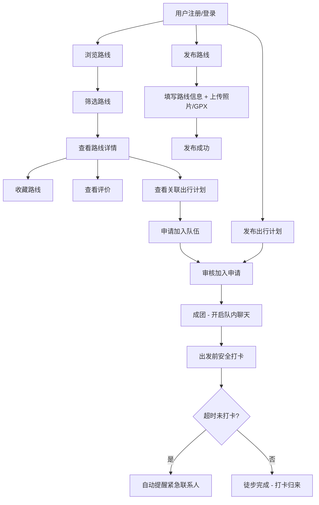

## 1. 产品概述

「山径」是一个户外徒步路线分享与同行组队社区平台，专注于为徒步爱好者提供路线信息共享、多维体验对比和组队出行服务。平台区别于跑步记录类应用，侧重于路线本身的完整信息（距离、海拔、难度、季节建议等）和基于真实徒步者的评价体系，同时提供组队出行和安全保障功能。

- **目标用户**：18-50岁户外徒步爱好者，涵盖从入门级到资深玩家
- **核心价值**：解决徒步路线信息分散、组队困难、安全预警缺失三大痛点

## 2. 核心功能

### 2.1 用户角色

| 角色 | 注册方式 | 核心权限 |
|------|----------|----------|
| 普通用户 | 邮箱/手机号注册 | 浏览路线、发布路线、收藏、评价、组队、安全打卡 |
| 队长（角色） | 发布出行计划后自动成为 | 审核加入申请、管理队伍、群聊管理 |

### 2.2 功能模块

1. **首页**：路线搜索与筛选、热门路线推荐、最新出行计划、季节推荐路线
2. **路线详情页**：路线完整信息、照片墙、轨迹地图、评价列表、关联出行计划
3. **发布路线页**：填写路线信息表单、上传照片、上传GPX文件、预览发布
4. **组队广场页**：出行计划列表、按路线/日期/人数筛选、申请加入
5. **队伍详情页**：队伍信息、成员列表、共享聊天群、出行计划详情
6. **个人中心页**：我的路线、我的收藏、我的队伍、紧急联系人设置、安全打卡

### 2.3 页面详情

| 页面名称 | 模块名称 | 功能描述 |
|----------|----------|----------|
| 首页 | 搜索筛选栏 | 按省份、难度、耗时、起点筛选路线 |
| 首页 | 热门路线卡片 | 展示路线封面图、名称、难度、距离、评分，可收藏 |
| 首页 | 最新出行计划 | 展示近期组队计划，含路线名、日期、已加入/期望人数 |
| 首页 | 季节推荐 | 根据当前季节推荐适合的路线 |
| 路线详情页 | 路线基本信息 | 距离、海拔升降、难度评级、参考耗时、季节建议、注意事项 |
| 路线详情页 | 照片墙 | 沿途实拍照片瀑布流展示，支持按季节筛选 |
| 路线详情页 | 轨迹地图 | GPX轨迹可视化展示，叠加海拔剖面图 |
| 路线详情页 | 评价区 | 实际徒步者评价列表，含季节、耗时、难度感受、对比不同人体验 |
| 路线详情页 | 关联出行计划 | 该路线下正在招募的出行计划 |
| 发布路线页 | 路线信息表单 | 填写名称、省份、起点、距离、海拔升降、难度、耗时、季节建议、注意事项 |
| 发布路线页 | 媒体上传 | 上传沿途照片（多图）、上传GPX轨迹文件 |
| 组队广场页 | 计划列表 | 出行计划卡片，含路线、日期、人数、状态 |
| 组队广场页 | 筛选器 | 按路线、日期范围、难度筛选 |
| 队伍详情页 | 队伍信息 | 路线、日期、集合地点、期望人数、注意事项 |
| 队伍详情页 | 成员列表 | 队长标记、成员头像昵称，队长可审核/移除 |
| 队伍详情页 | 共享聊天群 | 队内实时文字聊天 |
| 个人中心页 | 我的路线 | 已发布的路线列表 |
| 个人中心页 | 我的收藏 | 收藏的路线列表 |
| 个人中心页 | 我的队伍 | 已加入/已创建的队伍 |
| 个人中心页 | 紧急联系人 | 填写紧急联系人姓名和电话 |
| 个人中心页 | 安全打卡 | 出发前打卡记录预计返回时间，超时自动提醒紧急联系人 |

## 3. 核心流程

### 3.1 路线发布流程
用户点击发布路线 → 填写路线基本信息（名称、省份、起点、距离、海拔、难度、耗时、季节建议、注意事项） → 上传沿途照片 → 上传GPX轨迹文件 → 预览确认 → 发布成功，路线出现在首页

### 3.2 组队出行流程
用户发布出行计划（选择路线、设置日期、期望人数、集合地点） → 其他用户浏览到计划 → 感兴趣的用户申请加入 → 队长审核申请 → 通过后用户加入队伍 → 队内共享聊天群开启 → 出发前队员安全打卡（填写预计返回时间） → 徒步完成后打卡归来 → 若超时未打卡，系统自动通知紧急联系人

### 3.3 路线检索流程
用户进入首页 → 使用筛选条件（省份、难度、耗时、起点）→ 系统返回匹配路线列表 → 点击路线查看详情 → 查看评价和不同季节体验 → 收藏路线或查看关联出行计划

## 4. 用户界面设计

### 4.1 设计风格

- **整体风格**：山野自然风，融合大地色系与现代简约设计，传达户外探索的原始感与专业感
- **主色调**：深森林绿（#2D5016）作为品牌色，搭配暖砂岩色（#C4A265）作为点缀
- **辅助色**：雾灰（#F5F3EF）背景、岩灰（#6B7280）文字、警戒橙（#E97A2B）用于安全相关
- **按钮风格**：圆角（8px），主按钮深绿底白字，次按钮白底绿边框，hover带微妙阴影
- **字体**：标题使用 Noto Serif SC（衬线体，传达山野质感），正文使用 Noto Sans SC
- **布局风格**：卡片式布局，顶部固定导航，左侧边栏在详情页，大留白和呼吸感
- **图标**：使用 lucide-react 图标库，线性风格与自然主题统一
- **动效**：页面切换淡入、卡片hover轻微上浮、照片瀑布流加载动画

### 4.2 页面设计概述

| 页面名称 | 模块名称 | UI元素 |
|----------|----------|--------|
| 首页 | 顶部导航 | 深绿底白字Logo、搜索框、发布按钮、用户头像，固定顶部 |
| 首页 | 筛选栏 | 省份下拉、难度标签组、耗时范围滑块、起点搜索输入框 |
| 首页 | 路线卡片 | 大圆角卡片，左侧封面图，右侧路线名/难度星标/距离/评分，底部收藏心形图标 |
| 首页 | 出行计划 | 横向滚动卡片，日期高亮，进度条展示已加入/期望人数 |
| 路线详情页 | 信息面板 | 左侧大图+照片瀑布流，右侧信息面板（距离、海拔、难度星级、耗时、季节标签、注意事项） |
| 路线详情页 | 轨迹地图 | 全宽地图区域，下方海拔剖面图，GPX轨迹叠加 |
| 路线详情页 | 评价区 | 卡片式评价，头像+昵称+季节标签+评分+文字，支持按季节筛选标签 |
| 发布路线页 | 表单 | 分步骤表单（基本信息→照片上传→轨迹上传→预览），进度指示器 |
| 组队广场页 | 计划卡片 | 日历风格日期展示，路线缩略信息，人数进度环 |
| 队伍详情页 | 聊天区 | 底部固定输入框，消息气泡样式，系统消息居中灰色 |
| 个人中心页 | 侧边导航 | 左侧菜单列表，右侧内容区，紧急联系人和安全打卡使用警示橙强调 |
| 个人中心页 | 安全打卡 | 大圆按钮"出发打卡"/"安全归来"，打卡时间倒计时显示，超时红色闪烁预警 |

### 4.3 响应式设计

- 桌面优先设计，最大内容宽度 1280px 居中
- 平板端（768px-1024px）：卡片从双列变单列，侧边栏折叠为顶部tab
- 移动端（<768px）：底部导航栏替代顶部导航，照片单列瀑布流，筛选栏折叠为浮层

### 4.4 3D场景指引

不适用，本项目无3D场景需求。
