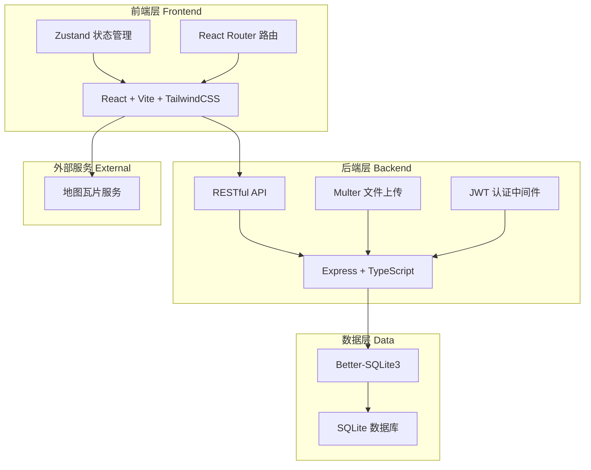
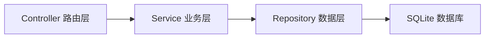
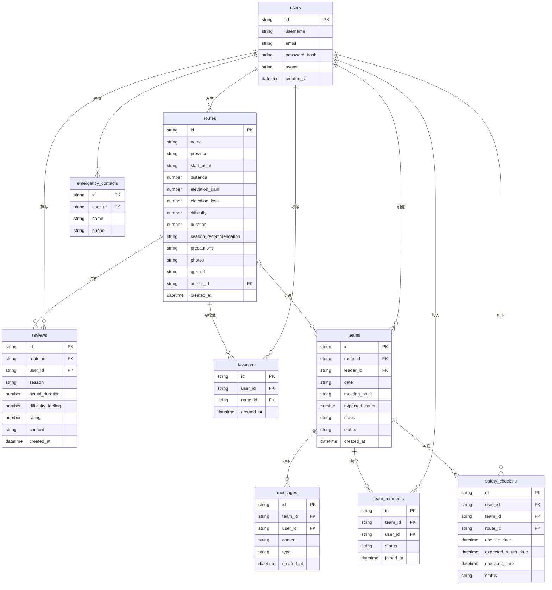

## 1. 架构设计



## 2. 技术说明

- **前端**：React@18 + TailwindCSS@3 + Vite
- **初始化工具**：vite-init
- **后端**：Express@4 + TypeScript（ESM格式）
- **数据库**：SQLite（Better-SQLite3），开发阶段使用 mock 数据
- **状态管理**：Zustand
- **路由**：React Router DOM
- **文件上传**：Multer（照片 + GPX文件）
- **地图展示**：Leaflet + OpenStreetMap瓦片
- **认证**：JWT Token
- **图标**：lucide-react

## 3. 路由定义

| 路由 | 用途 |
|------|------|
| `/` | 首页，路线搜索与推荐 |
| `/route/:id` | 路线详情页 |
| `/route/new` | 发布新路线 |
| `/teams` | 组队广场，出行计划列表 |
| `/team/:id` | 队伍详情页（含聊天） |
| `/team/new` | 发布出行计划 |
| `/profile` | 个人中心 |
| `/login` | 登录页 |
| `/register` | 注册页 |

## 4. API定义

### 4.1 认证相关

```
POST   /api/auth/register     注册
POST   /api/auth/login        登录
GET    /api/auth/me           获取当前用户信息
```

### 4.2 路线相关

```
GET    /api/routes             获取路线列表（支持筛选：province, difficulty, duration, startpoint）
GET    /api/routes/:id         获取路线详情
POST   /api/routes             创建路线（multipart/form-data，含照片和GPX）
POST   /api/routes/:id/favorite  收藏/取消收藏路线
GET    /api/routes/:id/reviews  获取路线评价
POST   /api/routes/:id/reviews  提交路线评价
```

### 4.3 组队相关

```
GET    /api/teams              获取出行计划列表（支持筛选）
GET    /api/teams/:id          获取队伍详情
POST   /api/teams              创建出行计划
POST   /api/teams/:id/join     申请加入队伍
PUT    /api/teams/:id/approve  审核加入申请
DELETE /api/teams/:id/members/:userId  移除队员
GET    /api/teams/:id/messages 获取队内聊天记录
POST   /api/teams/:id/messages 发送聊天消息
```

### 4.4 安全打卡

```
POST   /api/safety/checkin     出发打卡（含预计返回时间、紧急联系人）
POST   /api/safety/checkout    安全归来打卡
GET    /api/safety/status      获取当前打卡状态
PUT    /api/safety/contacts     设置紧急联系人
GET    /api/safety/contacts     获取紧急联系人
```

### 4.5 用户相关

```
GET    /api/users/:id/profile  获取用户公开信息
GET    /api/users/me/routes    获取我发布的路线
GET    /api/users/me/favorites 获取我收藏的路线
GET    /api/users/me/teams     获取我加入的队伍
```

### 4.6 TypeScript 类型定义

```typescript
interface Route {
  id: string
  name: string
  province: string
  startPoint: string
  distance: number
  elevationGain: number
  elevationLoss: number
  difficulty: 1 | 2 | 3 | 4 | 5
  duration: number
  seasonRecommendation: string[]
  precautions: string
  photos: string[]
  gpxUrl: string
  authorId: string
  authorName: string
  createdAt: string
  averageRating: number
  favoriteCount: number
}

interface Review {
  id: string
  routeId: string
  userId: string
  userName: string
  userAvatar: string
  season: string
  actualDuration: number
  difficultyFeeling: number
  rating: number
  content: string
  createdAt: string
}

interface Team {
  id: string
  routeId: string
  routeName: string
  leaderId: string
  leaderName: string
  date: string
  meetingPoint: string
  expectedCount: number
  notes: string
  status: 'recruiting' | 'confirmed' | 'completed' | 'cancelled'
  members: TeamMember[]
  createdAt: string
}

interface TeamMember {
  userId: string
  userName: string
  userAvatar: string
  status: 'pending' | 'approved' | 'rejected'
  joinedAt: string
}

interface Message {
  id: string
  teamId: string
  userId: string
  userName: string
  content: string
  type: 'text' | 'system'
  createdAt: string
}

interface SafetyCheckin {
  id: string
  userId: string
  teamId: string
  routeId: string
  checkinTime: string
  expectedReturnTime: string
  checkoutTime: string | null
  status: 'active' | 'returned' | 'overdue'
  emergencyContacts: EmergencyContact[]
}

interface EmergencyContact {
  name: string
  phone: string
}

interface User {
  id: string
  username: string
  email: string
  avatar: string
  emergencyContacts: EmergencyContact[]
  createdAt: string
}
```

## 5. 服务器架构图



## 6. 数据模型

### 6.1 数据模型定义



### 6.2 数据定义语言

```sql
CREATE TABLE users (
  id TEXT PRIMARY KEY,
  username TEXT NOT NULL UNIQUE,
  email TEXT NOT NULL UNIQUE,
  password_hash TEXT NOT NULL,
  avatar TEXT,
  created_at TEXT NOT NULL DEFAULT (datetime('now'))
);

CREATE TABLE routes (
  id TEXT PRIMARY KEY,
  name TEXT NOT NULL,
  province TEXT NOT NULL,
  start_point TEXT NOT NULL,
  distance REAL NOT NULL,
  elevation_gain REAL NOT NULL,
  elevation_loss REAL NOT NULL,
  difficulty INTEGER NOT NULL CHECK (difficulty BETWEEN 1 AND 5),
  duration REAL NOT NULL,
  season_recommendation TEXT NOT NULL,
  precautions TEXT,
  photos TEXT NOT NULL DEFAULT '[]',
  gpx_url TEXT,
  author_id TEXT NOT NULL REFERENCES users(id),
  created_at TEXT NOT NULL DEFAULT (datetime('now'))
);

CREATE TABLE reviews (
  id TEXT PRIMARY KEY,
  route_id TEXT NOT NULL REFERENCES routes(id) ON DELETE CASCADE,
  user_id TEXT NOT NULL REFERENCES users(id),
  season TEXT NOT NULL,
  actual_duration REAL NOT NULL,
  difficulty_feeling INTEGER NOT NULL CHECK (difficulty_feeling BETWEEN 1 AND 5),
  rating INTEGER NOT NULL CHECK (rating BETWEEN 1 AND 5),
  content TEXT,
  created_at TEXT NOT NULL DEFAULT (datetime('now'))
);

CREATE TABLE favorites (
  id TEXT PRIMARY KEY,
  user_id TEXT NOT NULL REFERENCES users(id),
  route_id TEXT NOT NULL REFERENCES routes(id),
  created_at TEXT NOT NULL DEFAULT (datetime('now')),
  UNIQUE(user_id, route_id)
);

CREATE TABLE teams (
  id TEXT PRIMARY KEY,
  route_id TEXT NOT NULL REFERENCES routes(id),
  leader_id TEXT NOT NULL REFERENCES users(id),
  date TEXT NOT NULL,
  meeting_point TEXT NOT NULL,
  expected_count INTEGER NOT NULL,
  notes TEXT,
  status TEXT NOT NULL DEFAULT 'recruiting' CHECK (status IN ('recruiting', 'confirmed', 'completed', 'cancelled')),
  created_at TEXT NOT NULL DEFAULT (datetime('now'))
);

CREATE TABLE team_members (
  id TEXT PRIMARY KEY,
  team_id TEXT NOT NULL REFERENCES teams(id) ON DELETE CASCADE,
  user_id TEXT NOT NULL REFERENCES users(id),
  status TEXT NOT NULL DEFAULT 'pending' CHECK (status IN ('pending', 'approved', 'rejected')),
  joined_at TEXT NOT NULL DEFAULT (datetime('now')),
  UNIQUE(team_id, user_id)
);

CREATE TABLE messages (
  id TEXT PRIMARY KEY,
  team_id TEXT NOT NULL REFERENCES teams(id) ON DELETE CASCADE,
  user_id TEXT REFERENCES users(id),
  content TEXT NOT NULL,
  type TEXT NOT NULL DEFAULT 'text' CHECK (type IN ('text', 'system')),
  created_at TEXT NOT NULL DEFAULT (datetime('now'))
);

CREATE TABLE safety_checkins (
  id TEXT PRIMARY KEY,
  user_id TEXT NOT NULL REFERENCES users(id),
  team_id TEXT REFERENCES teams(id),
  route_id TEXT REFERENCES routes(id),
  checkin_time TEXT NOT NULL DEFAULT (datetime('now')),
  expected_return_time TEXT NOT NULL,
  checkout_time TEXT,
  status TEXT NOT NULL DEFAULT 'active' CHECK (status IN ('active', 'returned', 'overdue'))
);

CREATE TABLE emergency_contacts (
  id TEXT PRIMARY KEY,
  user_id TEXT NOT NULL REFERENCES users(id) ON DELETE CASCADE,
  name TEXT NOT NULL,
  phone TEXT NOT NULL
);

CREATE INDEX idx_routes_province ON routes(province);
CREATE INDEX idx_routes_difficulty ON routes(difficulty);
CREATE INDEX idx_routes_author ON routes(author_id);
CREATE INDEX idx_reviews_route ON reviews(route_id);
CREATE INDEX idx_favorites_user ON favorites(user_id);
CREATE INDEX idx_favorites_route ON favorites(route_id);
CREATE INDEX idx_teams_route ON teams(route_id);
CREATE INDEX idx_teams_status ON teams(status);
CREATE INDEX idx_team_members_team ON team_members(team_id);
CREATE INDEX idx_team_members_user ON team_members(user_id);
CREATE INDEX idx_messages_team ON messages(team_id);
CREATE INDEX idx_safety_checkins_user ON safety_checkins(user_id);
CREATE INDEX idx_safety_checkins_status ON safety_checkins(status);
CREATE INDEX idx_emergency_contacts_user ON emergency_contacts(user_id);
```
